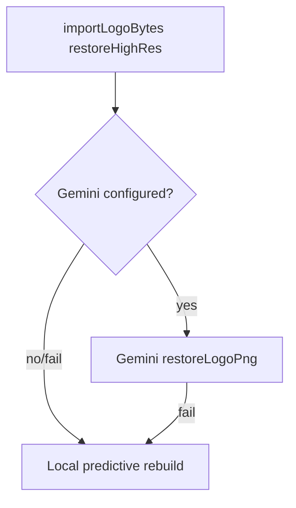

# Swift Document Generator — Structure & Code Audit

**Date:** 2026-08-05  
**Scope:** `mobile/` (Flutter Windows + Android), `services/recreate-logo/`, `native/logo_recreate/`, `tools/logo_vectorizer/`, `scripts/`, root Python leftovers  
**App version at audit:** started `1.1.47+70`; Phase 2 bumps to `1.1.48+71`  
**Phase:** Detailed report (Phase 1) + Phase 2 safe fixes applied in-repo (see §9).

---

## 1. Architecture overview

### 1.1 Product shape

Single Flutter package (`mobile/`, package name `swift_shipping_label`) ships:

| Document | Engine | Notes |
|----------|--------|--------|
| Shipping Label | `ShippingLabelPdf` | Landscape Letter, multi-page piece counts |
| Receiving Label | Same class | Single-page staging skid |
| Bill of Lading | `BolLabelPdf` | Portrait Letter, 3 copies (STORE/DRIVER/CUSTOMER) |

Product title is **Swift Document Generator**; binary/process remains `swift_shipping_label.exe` / Android `applicationId` under the old shipping-label name. GitHub repo: `StagingLogShippingTracker/swift-shipping-label`.

### 1.2 Flutter shared UI + platform branches

```
main.dart
  └─ AppStorage.open() + ShippingLabelPdf.load()
  └─ MaterialApp (light; Windows may select dark + fontScale)
       └─ AutoUpdateHost
            └─ HomeScreen  (~2.9k lines — god object)
                 ├─ Platform.isWindows → menu + rail + workspace scaffold
                 └─ else (Android) → header + kind selector + bottom Generate
```

| Concern | Windows | Android |
|---------|---------|---------|
| Theme | Light/dark + UI font scale | Always light, scale forced `1.0` |
| Customize PDF | `windows_customize.dart` | No UI (settings may load from disk) |
| Menu / shortcuts | `windows_menu_bar.dart` | N/A |
| Window snap | `windows_window_snap.dart` (PowerShell) | N/A |
| Feedback / F2 | Help menu | Not wired |
| Generate affordance | Workspace pane button **or** File/Ctrl+Enter | Always bottom bar |
| Share/open PDF | `platform_io` opens file | Native share sheet |
| Recreate priority | Gemini restore; local rebuild if Gemini is down | Same |

### 1.3 PDF engines

- **Fonts:** Oswald + Calibri bundled; BOL uses Helvetica in places for print flatness.
- **Swift logo:** `assets/images/swift_supply_logo_orange.png` (pubspec).
- **Options:** `PdfRenderOptions` — logo placement/scale, body font, show logos. **`fontScale` and `pageOrientation` are persisted and shown in Customize but ignored by builders** (shipping always landscape; BOL always portrait).
- **Legacy Python:** root `generate_swift_*_pdf.py` / xlsx — reference / leftovers; Flutter is the shipping product.

### 1.4 Recreate backends

**Runtime order** (`mobile/lib/logo_recreate.dart`) — code is source of truth:

| Step | Windows | Android |
|------|---------|---------|
| 1 | Gemini logo restore (Windows + Android) | Same |
| 2 | Local predictive rebuild if Gemini is down | Same |
| 3 | Optional local Python `logo_restorer.py` (RealESRGAN) | Windows offline only |

Supporting pieces:

- Gemini (`GeminiClient.restoreLogoPng`) — primary print-ready redraw
- Local `logo_restorer.py` / `LogoImageProcessor.rebuildPredictedEdges` — offline fallback

### 1.5 Storage / sync

`AppStorage.open()` → `Documents/swift_document_generator/` (migrates from `swift_shipping_label` if new root missing).

**Collision:** This git clone lives at that same path. Runtime data (`presets.json`, `settings.json`, `customer_logos/`, `filled/`, `signatures/`) is the working tree.

| Store | Sync |
|-------|------|
| Presets | `PresetSync` ↔ Supabase (open RLS, anon key) |
| Signatures | `SignatureSync` ↔ Supabase + storage bucket |
| BOL serial | `bol_document_number.dart` → RPC `next_bol_serial` |
| UI settings | Local `settings.json` only |
| Update schedule | `update_schedule.json` |

### 1.6 Updates

- Flutter: `AppUpdateService` + `update_sheet.dart` + `auto_update_scheduler.dart` (3pm Denver).
- Windows in-app: downloads **`SwiftDocumentGenerator-Setup.exe` only** (zip classified but not installed) — **do not break**.
- Android: APK via FileProvider / `MainActivity.installApk`.
- Publish: `scripts/publish_release.ps1` → build Windows + installer + APK → GitHub Release.
- Legacy `app_update.py` still zip-based under LocalAppData — **not** used by Flutter.

---

## 2. Errors / bugs / crash risks / incorrect behavior

### Blocker / high

| ID | Issue | Where |
|----|--------|--------|
| B1 | **Local Python Recreate PNG defaults to white background** — historical Recreate path; logo restore now uses Gemini. | `logo_recreate.dart` (removed from product) |
| B2 | Cloud ESRGAN host retired; Gemini is primary restore; local rebuild if offline. | `logo_restorer.dart` |
| B3 | **Windows Generate button only in workspace pane** — if workspace hidden or layout not “wide”, primary Generate vanishes (menu/Ctrl+Enter only). | `home_screen.dart` 2205–2212, 2293–2308 |
| B4 | **No Windows `logo_recreate.dll` packaged** — offline Windows without Python falls through to broken/missing native then Supabase. `build_windows.ps1` copies `tools/` only. | `build_windows.ps1`; `logo_recreate_native.dart` 195–214 |

### Major

| ID | Issue | Where |
|----|--------|--------|
| M1 | Preset/signature sync “newer” uses **whole-file mtime**, not per-entity timestamps | `preset_sync.dart` ~331–339; `signature_sync.dart` |
| M2 | Logo sync re-imports via `importLogoBytes` → rename `(2)` / reprocess; remote refs can diverge | `preset_sync.dart` ~284–299 |
| M3 | `_buildItemTypeField` **mutates TextEditingController during build** | `home_screen.dart` 1395–1400 |
| M4 | Dialog `TextEditingController`s never disposed (`_askString`, piece-plan, etc.) | `home_screen.dart` 499–521+ |
| M5 | Customize **pageOrientation / fontScale are no-ops** for PDF | `pdf_render_options.dart`; `windows_customize.dart`; PDF builders |
| M6 | Auto-update marks day done **before** dialog/install success | `auto_update_scheduler.dart` 221 |
| M7 | Setup launched while app still running — file locks possible | `app_update.dart` |
| M8 | *(retired)* Cloud restore auth cascade — service removed | — |
| M9 | *(retired)* Stale cloud-restore docs — service removed | — |
| M10 | Android release signed with **debug** keystore | `android/app/build.gradle.kts` |

### Minor / crash-adjacent

| ID | Issue | Where |
|----|--------|--------|
| m1 | Corrupt logo/`PdfImage.file` without try/catch → hard PDF failure | `shipping_label_pdf.dart`, `bol_label_pdf.dart` |
| m2 | `LogoRecreate.isAvailable()` always `true` → dead diagnostic branch | `logo_recreate.dart` 34–36; `app_storage.dart` |
| m3 | `sigkill` unreliable on Windows process timeout | `logo_recreate.dart` 241 |
| m4 | Incomplete migrate when both legacy + new document roots exist | `app_storage.dart` 85–90 |
| m5 | Signature delete removes DB row, not storage object | `signature_sync.dart` |
| m6 | MethodChannel busy picker / deprecated `startActivityForResult` | `MainActivity.kt` |
| m7 | Hotkey “Assign” UI does not apply overrides | `windows_menu_bar.dart` |
| m8 | Feedback body hardcodes `Platform: Windows` | `feedback_forms.dart` 116 |

---

## 3. Redundancies

| Item | Notes |
|------|--------|
| Root Python PDF/xlsx generators | Parallel to Flutter engines; useful as reference, confuse “source of truth” |
| `app_update.py` | Dead for Flutter; zip-only vs Setup.exe |
| Branding copies | `assets/brand/*`, `mobile/assets/images/*`, root `swift_supply_logo*.png`, `branding/app_icon.png` — easy drift |
| Unused pubspec assets | `swift_supply_logo.png`, `swift_supply_logo_document.png` present but not listed |
| Duplicate menu entries | Customize / Choose PDF output in File and Options |
| `_Card` padding | `dense ? 8 : 8` |
| `feedbackDiagnosticsJson` | Defined, never called |
| Massive QA/trace artifacts | `_trace_tests/`, `_recreate_qa/`, `_*.png` at repo root — clutter DX/git |
| `customer_logos/` duplicates | Many `_2_` / `(2)` variants from sync/import uniquify |

---

## 4. Anomalies (naming, version, parity)

| Topic | Observation |
|-------|-------------|
| Naming | Package/exe `swift_shipping_label` vs UI “Swift Document Generator” vs assets `SwiftDocumentGenerator-*` |
| Versions | Aligned at **1.1.47** (+70 Flutter); publish without `-Version` won’t bump build |
| Runner.rc fallback | `#define VERSION_AS_STRING "1.0.0"` only if Flutter macros absent |
| Android dark/customize | Settings exist; UI cannot change them on phone (intentional mobile focus, but stored prefs can surprise) |
| Recreate docs vs code | Cloud ESRGAN host retired; Gemini is primary restore |
| render_width | Gemini/local restore target 3000px tall |
| Data root | App Documents == this OneDrive git repo |
| Python `app_paths.py` | LocalAppData when frozen — different from Flutter Documents path |

---

## 5. Structural issues

| Issue | Detail |
|-------|--------|
| **God file** | `home_screen.dart` ~2896 lines: forms, logos, generate, sync UX, both scaffolds |
| Large PDF files | `bol_label_pdf.dart` ~1289; `shipping_label_pdf.dart` ~1228; `logo_finder.dart` ~1168 |
| No circular imports | `home_screen` → windows_* → no back-edge; healthy |
| Settings sprawl | `AppUiSettings` in `app_storage.dart`; PDF/UI enums in `pdf_render_options.dart` |
| Fragile publish | Depends on asset **names**, Flutter path discovery, Inno Setup, synced Android build dirs (`%LOCALAPPDATA%\swift-document-generator-mobile`) |
| Android gradle | `flutter { source = "../.." }` points at monorepo root — easy to misread |
| Native Windows | No CMake target / copy step for `logo_recreate.dll` next to runner |

Suggested future split (not required for Phase 2): form controller, logo workspace, `windows_scaffold` / `mobile_scaffold`, shared Generate bar.

---

## 6. Security / secrets

| Item | Assessment |
|------|------------|
| Supabase anon JWT in `app_config.dart` | Expected for client; **RLS is open (`USING (true)`)** — anyone with the key can CRUD shared org presets/logos/signatures |
| Same anon key as old cloud restore | Cloud restore services removed |
| Update downloads | Trusts GitHub `browser_download_url`; no hash/signature verify |
| No `.env` in repo | Good; Gemini tokens via dart-define / gitignored `.env` |
| Logo finder tokens | Optional env; can appear in query strings if set |
| Android debug signing | Not Play-ready; sideload/update identity risk |

---

## 7. Performance / DX concerns

| Area | Concern |
|------|---------|
| Recreate | Flood-fill on large uploads; no client max dimension before recreate |
| `home_screen` | Rebuild cost; `existsSync` on UI thread for logos |
| Sync | Whole-file mtime + re-import logos = wasteful and incorrect |
| DX | Thousands of untracked QA PNGs/SVGs; OneDrive locking dist builds |
| Local Python deps | `tools/.../requirements.txt` may lack optional raster extras |
| Tests | Unit/integration present; recreate needs network/device |

---

## 8. Prioritized fix list

### Blocker

1. **B1** — Pass `--render-background transparent` (and/or fix `__main__.py` recreate default) — `mobile/lib/logo_recreate.dart`, `tools/logo_vectorizer/__main__.py`
2. **B3** — Always show Generate on Windows when workspace pane is hidden — `mobile/lib/home_screen.dart`
3. **B2** — Cloud ESRGAN host retired (Gemini restore) — `mobile/lib/logo_restorer.dart`
4. **B4** — Document + optionally bundle `logo_recreate.dll` in `scripts/build_windows.ps1` when built (do not invent a broken path)

### Major

5. **M9** — Cloud restore docs retired with the service
6. **M3** — Stop mutating controllers during build — `home_screen.dart`
7. **M5** — Hide or wire `pageOrientation`/`fontScale` (prefer hide/label as unused until wired)
8. **M6** — Mark auto-update day after successful check *or* only after dismiss without “Update” — careful UX
9. **M1/M2** — Per-preset timestamps + identity-preserving logo sync (larger change — defer careful design)

### Minor

10. Dispose dialog controllers; fix `_Card` padding; remove dead `feedbackDiagnosticsJson` or use it
11. Feedback platform string from `Platform.operatingSystem`
12. Wrap `PdfImage` load failures
13. main.dart stale comment cleanup
14. Align local Python restore extras with `logo_restorer.py`

### Polish

15. Naming unification plan (exe vs product) — do not rename exe without updating snap/update
16. Split `home_screen.dart` only when compiling and tested
17. Clean QA artifact gitignore patterns
18. Android release signing for production

---

## Appendix A — Key file sizes (lines)

| Lines | File |
|------:|------|
| ~2896 | `mobile/lib/home_screen.dart` |
| ~1289 | `mobile/lib/pdf/bol_label_pdf.dart` |
| ~1228 | `mobile/lib/pdf/shipping_label_pdf.dart` |
| ~1168 | `mobile/lib/logo_finder.dart` |
| ~870 | `mobile/lib/windows_menu_bar.dart` |
| ~596 | `mobile/lib/app_storage.dart` |
| ~344 | `mobile/lib/logo_recreate.dart` |

## Appendix B — Recreate flow (actual)



## Appendix C — Do not break

- Windows/Android logo restore: Gemini, then local predictive rebuild
- In-app Update: **Setup.exe only** (`AppConfig.windowsSetupAsset`)
- Asset names in `publish_release.ps1` / `version.py` / `AppConfig`

---

## 9. Phase 2 fixes applied (this pass)

| Fix | Files |
|-----|--------|
| Local Recreate PNG transparent | `logo_recreate.dart`, `tools/logo_vectorizer/__main__.py` |
| Windows Generate when workspace hidden | `home_screen.dart` |
| Item-type normalize post-frame | `home_screen.dart` |
| Dispose `_askString` controller | `home_screen.dart` |
| Auto-update mark-day after prompt | `auto_update_scheduler.dart` |
| Feedback platform string | `feedback_forms.dart` |
| Dead `feedbackDiagnosticsJson` removed | `feedback_forms.dart` |
| Font-scale “not applied yet” label | `windows_customize.dart` |
| Cloud restore docs retired | Gemini is the restore path |
| Optional DLL copy in Windows build | `scripts/build_windows.ps1` |
| main.dart comment cleanup | `main.dart` |
| Version bump | `1.1.48` |

**Deferred (too large / risky for this pass):** per-entity sync timestamps, logo sync identity, wiring PDF fontScale/orientation, home_screen split, Android release signing, building Rust DLL from scratch.
